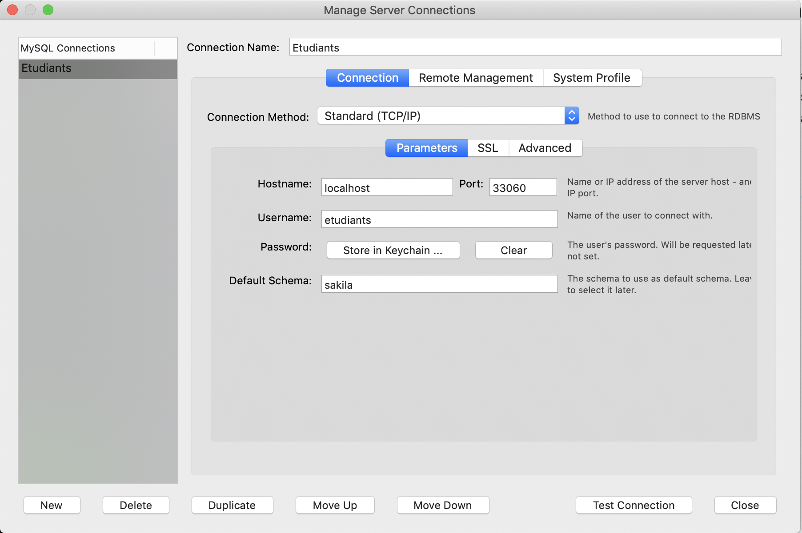

### Example de bases de données
http://dev.mysql.com/doc/index-other.html

### Fichier sakila-db
. Télécharger le fichier `sakila-db.zip` dans le répertoire racine de l'utilisateur. (Home Directory ~ )

http://downloads.mysql.com/docs/sakila-db.zip

. Décompresser le fichier

```
$ unzip ~/Downloads/sakila-db.zip  -d ~/Downloads
```

### Charger les données dans Docker 

- Créer la base de données sakila

```
$ docker exec --interactive --tty some-mysql \
              mysql --user root --password --execute \
              "CREATE DATABASE sakila;"
```

- Créer un utilisateur

```
$ docker exec --interactive some-mysql  \
              mysql --user root -ppassword --execute \
              "CREATE USER 'etudiants'@'%' IDENTIFIED BY 'etudiants_1';"
```

- Accorder tous les droits a l'utilisateur d'utiliser la base sakila

```
$ docker exec --interactive some-mysql  \
              mysql --user root -ppassword --execute \
              "GRANT ALL ON sakila.* TO 'etudiants'@'%';"
```

- Charger la base

```
$ docker exec  --interactive some-mysql \
               mysql --user root -ppassword sakila < ~/Downloads/sakila-db/sakila-schema.sql
```

- Charger les données

```
$ docker exec  --interactive some-mysql \
               mysql --user root -ppassword sakila < ~/Downloads/sakila-db/sakila-data.sql
```

### Se connecter à [MySQL WorkBench](https://www.mysql.com/fr/products/workbench/)



### Éxécuter les commandes SQL en se servant du modèle ci-dessous


# [Participation](Participation.md)
