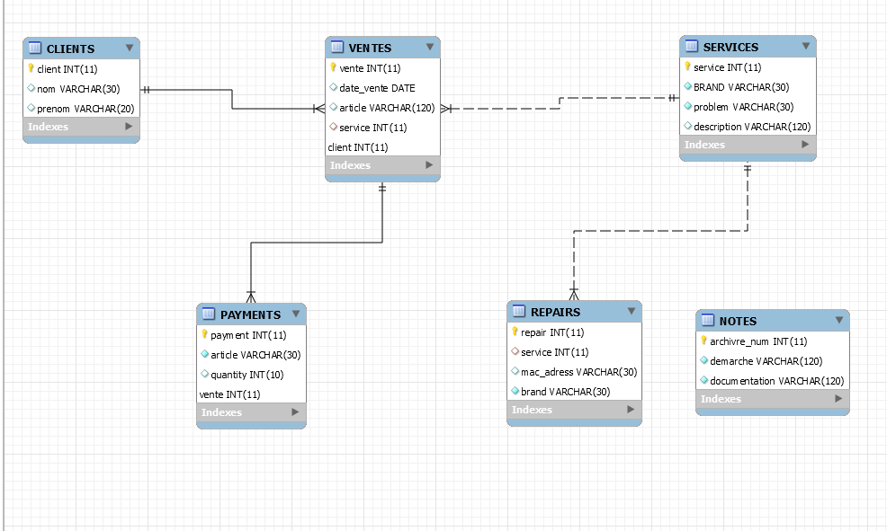
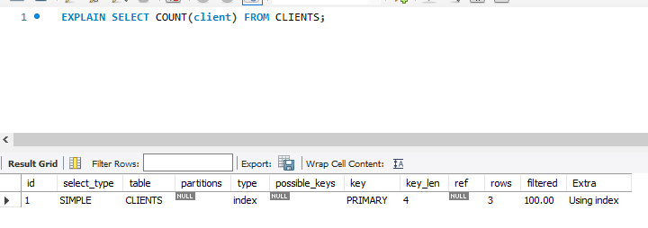

## technical_support




## Rapport
* 1- Imprimer le nombre total des clients.
* 2- Imprimer le nom et le prenom des clients qui ont recu des services le 06 decembre 2019.


## Requetes
* 1-
```sql
SELECT COUNT(client) FROM CLIENTS;
```
* 2-
```sql
SELECT CLIENTS.nom, CLIENTS.prenom FROM CLIENTS 
JOIN VENTES
ON (CLIENTS.client = VENTES.client)
WHERE VENTES.date_vente = '2019-12-06';
```


## Explain

