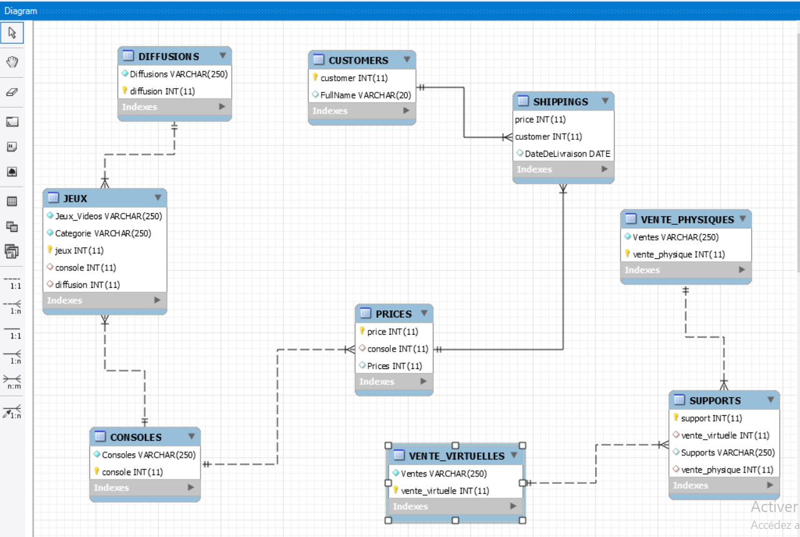

## Jeux Videos DataBase




## REQUETES

1- Imprimer tout les jeux de consoles Playsation

2- Imprimer le nombre total des consoles 

3- Imprimer les clients qui ont recu des livraisons le 12 decembre 2019 

R1- 
```sql
SELECT * FROM JEUX JOIN CONSOLES
ON (JEUX.console = CONSOLES.console)
WHERE CONSOLES.Consoles ='PS4';
```
R2-
```sql
SELECT COUNT(console) FROM CONSOLES;
```

R3-
```sql
SELECT * FROM SHIPPINGS 
JOIN CUSTOMERS 
ON (SHIPPINGS.customer = CUSTOMERS.customer)
WHERE SHIPPINGS.DateDeLivraison = '2019-12-09';
```
