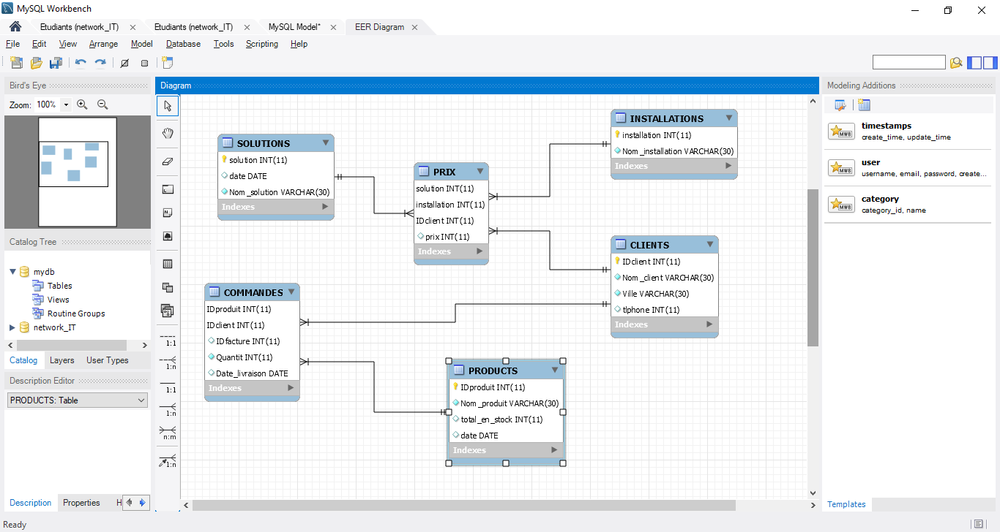
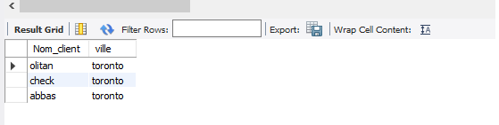

network_IT database

############################################
Rapport

-1 -Pour obtenir seulement la liste des clients qui habitent à toronto, il faut effectuer la requête 

-2 -imprimer la quantité acheter pour chaque client et la date de livraison

-3 -imprimer moyenne des prix

-4 -imprimer la somme des prix > 1000

Requetes&screenshot
network_IT database

############################################
Rapport

-1 -Pour obtenir seulement la liste des clients qui habitent à toronto, il faut effectuer la requête 

-2 -imprimer la quantité acheter pour chaque client et la date de livraison

-3 -imprimer moyenne des prix

-4 -imprimer la somme des prix > 1000

Requetes&screenshot

1 -Pour obtenir seulement la liste des clients qui habitent à toronto, il faut effectuer la requête 

   -SELECT Nom_client, ville FROM CLIENTS WHERE ville = 'toronto';
   

1 -Pour obtenir seulement la liste des clients qui habitent à toronto, il faut effectuer la requête 

   -SELECT Nom_client, ville FROM CLIENTS WHERE ville = 'toronto';
   

-2 -imprimer la quantité acheter pour chaque client et la date de livraison

SELECT IDfacture, Nom_client, Nom_produit, Quantit, Date_livraison FROM PRODUCTS
inner join COMMANDES ON PRODUCTS.IDproduit=COMMANDES.IDproduit
inner join CLIENTS on COMMANDES.IDclient=CLIENTS.IDclient;

-3 -imprimer moyenne des prix
---
SELECT AVG(Prix) FROM PRIX;

 -4 -imprimer la somme des prix > 1000

SELECT IDfacture, Nom_client,  sum(prix) FROM PRIX
inner join CLIENTS on PRIX.IDclient=CLIENTS.IDclient
inner join COMMANDES ON CLIENTS.IDclient=COMMANDES.IDclient 
GROUP BY IDfacture, Nom_client
HAVING SUM(prix) > 1000

  -5 -imprimer tous les produits  "camera" acheter par les clients entre '2019-01-01' AND '2019-12-09'

SELECT IDfacture, Nom_client, Nom_produit, Date_livraison FROM PRODUCTS

inner join COMMANDES ON PRODUCTS.IDproduit=COMMANDES.IDproduit

inner join CLIENTS on COMMANDES.IDclient=CLIENTS.IDclient

WHERE Nom_produit='camera' 

AND Date_livraison BETWEEN '2019-01-01' AND '2019-12-09' ;

