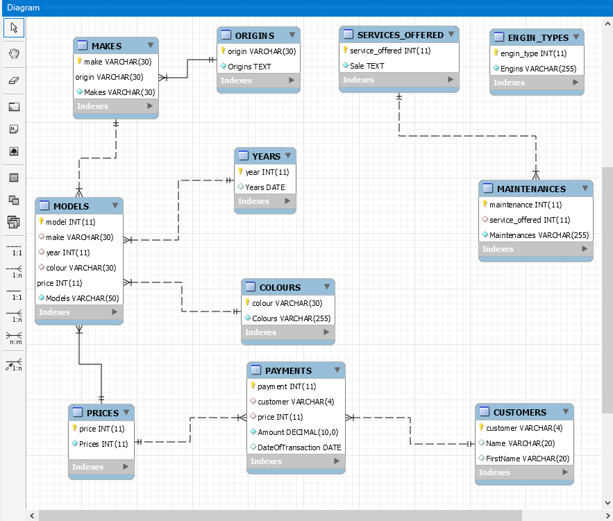
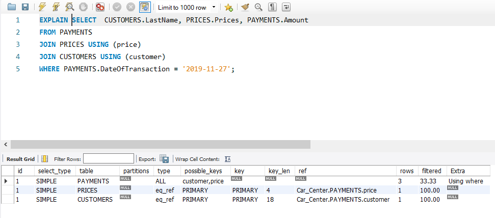

# Capture de ma Base de donnees!
# Car_Center



# :ab: Query Section

## Rapport

* 1- Imprimer le model et la marque des voitures d'origines Americaines.
* 2- Imprimer le model et le prix des voitures de couleurs noirs.
* 3- Imprimer le nom et le prenom des clients et les dates des transactions effectuees. 
* 4- Imprimer la moyenne des prix des voitures.
* 5- Imprimer le nom des clients, le prix initial des voiture et le montant final des transactions effectuees le 27 novembre 2019.

========================

## Requetes

:one:
```sql
SELECT MODELS.Models, MAKES.Makes FROM MAKES
JOIN MODELS 
ON ( MODELS.make = MAKES.make)
WHERE MAKES.origin = 'usa';
 ```

:two:
```sql
SELECT MODELS.Models, PRICES.Prices FROM MODELS
JOIN PRICES
ON (MODELS.price = PRICES.price)
WHERE MODELS.colour = 'blk' ;
```

:three:
```sql
 SELECT CUSTOMERS.Name, CUSTOMERS.FirstName, PAYMENTS.DateOfTransaction 
 FROM CUSTOMERS
 JOIN PAYMENTS
 ON (CUSTOMERS.customer = PAYMENTS.customer);
  ```

:four:
```sql
 SELECT AVG(Prices) FROM PRICES;
 ```
 
 :five:
 ```sql
SELECT  CUSTOMERS.LastName, PRICES.Prices, PAYMENTS.Amount
FROM PAYMENTS
JOIN PRICES USING (price)
JOIN CUSTOMERS USING (customer)
WHERE PAYMENTS.DateOfTransaction = '2019-11-27';
```


### EXPLAIN 
 


Author: <.@Toch90>
