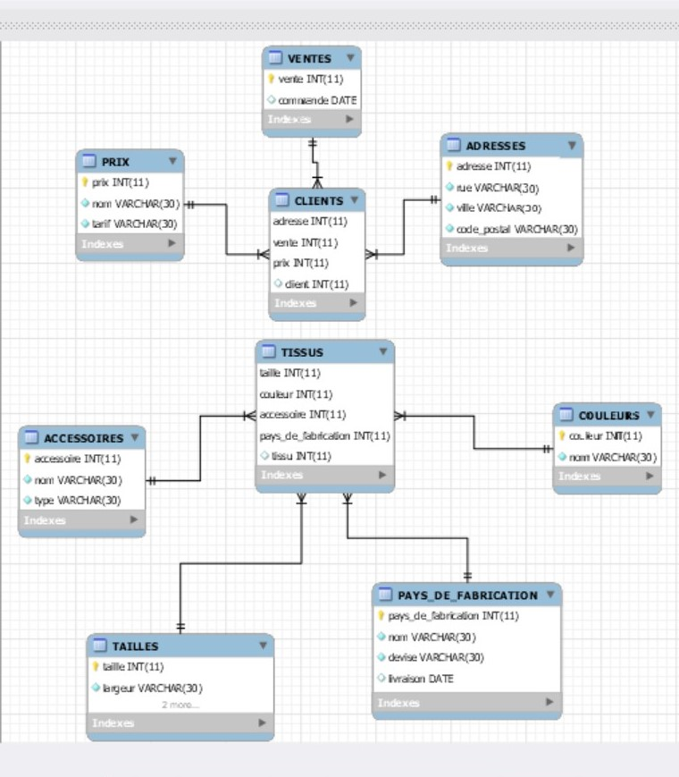

# 🤳 Capture d'écran de ma base de données



## Nom de domaine: 

HIJABFASHION

## :ab: Requetes à chercher:

1- imprimer les villes des clients qui ont fait une commande au mois octobre 

2- imprimer les dates de livraison des tissus en couleur pale 

3- imprimer les accessoires des tissus fabriqués au maroc 


## Requetes SQL:

# R1

```sql

SELECT ADRESSES.ville FROM ADRESSES
INNER JOIN Clients ON (CLIENTS.adresse = ADRESSES.adresse)
INNER JOIN VENTES ON (VENTES.vente = CLIENTS.vente)
where VENTES.commande = 'octobre';

```

# R2


