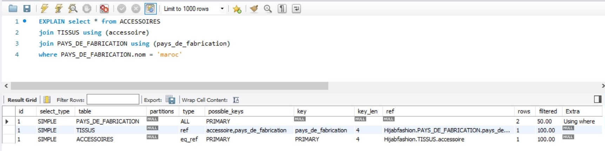

# 🤳 Capture d'écran de ma base de données


## Nom de domaine: 

### Hijabfashion 🧕


## :ab: Requetes à chercher:

:one: Imprimer les pays des clients qui ont fait une commande au 2019-11-10

:two: Imprimer les dates de livraison des tissus en couleur pale 

:three: Imprimer les accessoires des tissus fabriqués au maroc 

:four: Quel est la moyenne des prix ?

:five: Quel est le nombre des commandes faites ?


## Requetes SQL:

# R1

```sql

SELECT ADRESSES.pays FROM ADRESSES
JOIN CLIENTS using (adresse)
JOIN VENTES using (vente)
where VENTES.commande = '2019-11-10';

```

# R2

```sql

Explain SELECT livraison FROM PAYS_DE_FABRICATION
JOIN TISSUS USING (pays_de_fabrication)
JOIN COULEURS USING (couleur)
WHERE COULEURS.nom = 'pale';

```

# R3

```sql

select * from ACCESSOIRES
join TISSUS using (accessoire)
join PAYS_DE_FABRICATION using (pays_de_fabrication)
where PAYS_DE_FABRICATION.nom = 'maroc'

```

# R4

```sql
 SELECT AVG(prix) FROM PRIX;
```

# R5

```sql
 SELECT count(commande) from VENTES;
 ```
 
## :pushpin: Explain

