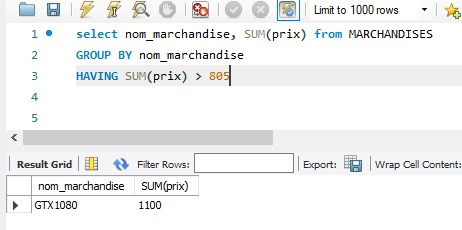

# Carte_graphique


### Rapport

:heavy_check_mark: Imprimer les clients qui habites dans la ville de vancouver et ottawa.

:heavy_check_mark: Imprimer les tables client, marchandise, prix et payment.

:heavy_check_mark: Imprimer le nom des marchandises et la description où le numero de vente est 10.

:heavy_check_mark: Imprimer le groupe des marchandises où la somme est plus grande que 805

### :one: Requête

```
select Nom_client, ville from CLIENTS 
where Ville= 'vancouver' or ville= 'ottawa';
```


### :two: Requête

```
SELECT Nom_client, nom_marchandise, prix, payment FROM MARCHANDISES
inner join PAYMENT ON MARCHANDISES.marchandise=PAYMENT.marchandise
inner join CLIENTS on PAYMENT.idclient=CLIENTS.idclient;
```


### :three: Requête

```
select Num_vente, nom_marchandise,  description_marchandise, prix from MARCHANDISES
inner join PAYMENT on MARCHANDISES.marchandise=PAYMENT.marchandise
inner join VENTES on PAYMENT.Idvente=VENTES.idvente where Num_vente= '10';
```


### :four: Requête

```
select nom_marchandise, SUM(prix) from MARCHANDISES
GROUP BY nom_marchandise
HAVING SUM(prix) > 805;
```



## :pushpin: Si tu ne fais pas le > 805 la base de données affichera tout le prix


