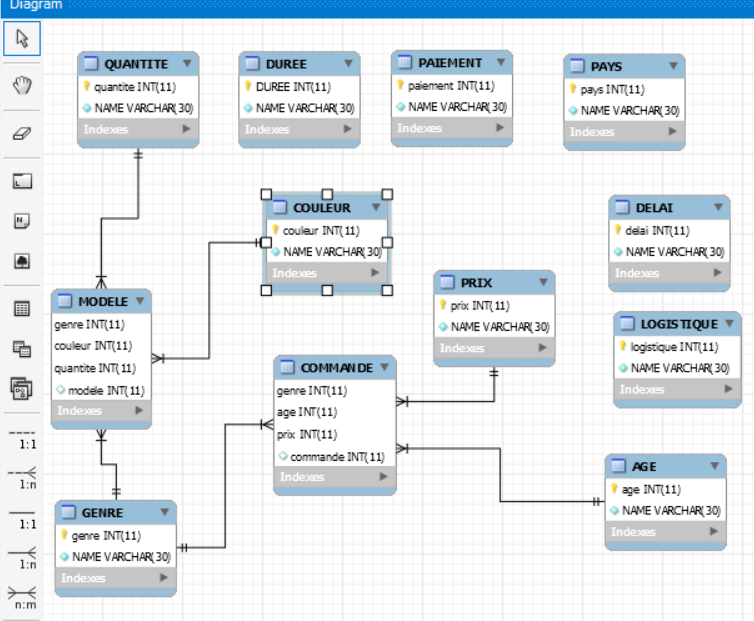
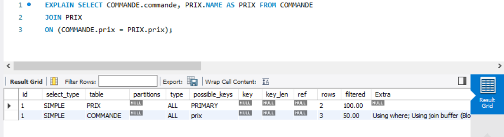

# Capture de ma Base de donnees!
## Boubou



## :ab: Query Section

* 1- Imprimer le nombre total des modeles.
* 2- Imprimer la quantite des modeles de couleur noir.
* 3- Imprimer tous les commandes et leurs prix de ventes.


========================

# Requetes

:one:


```sql

SELECT COUNT(model) FROM MODELE;

 ```

:two:

```sql

SELECT QUANTITE.NAME AS QUANTITES  FROM QUANTITE 
JOIN MODELE USING (quantite)
JOIN COULEUR USING (couleur)
WHERE COULEUR.NAME = 'noir';


```

:three:

```sql

SELECT COMMANDE.commande, PRIX.NAME AS PRIX FROM COMMANDE
JOIN PRIX
ON (COMMANDE.prix = PRIX.prix);

```


# Explain plan Query




