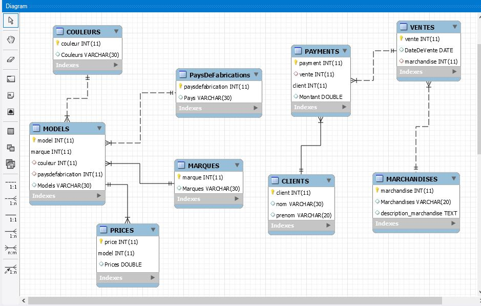

# MAGASIN



Rapport

1-imprimer la moyenne des prix des motos
2-imprimer tous les marchandises vendus le 14 mars 2019
3-Imprimer le model des motos d'origine japonaise 


Requetes
1-
```sql
SELECT AVG(Prices) FROM PRICES;
```
2-
```sql
SELECT * FROM MARCHANDISES 
JOIN VENTES 
ON (MARCHANDISES.marchandise = VENTES.marchandise)
WHERE VENTES.DateDeVente = '2019-03-14';
```
3-
```sql
SELECT MODELS.Models FROM MODELS
JOIN PaysDeFabrications
ON (MODELS.paysdefabrication = PaysDeFabrications.paysdefabrication)
WHERE PaysDeFabrications.Pays = 'Japon';
```

EXPLAIN 

EXPLAIN SELECT MODELS.Models FROM MODELS
JOIN PaysDeFabrications
ON (MODELS.paysdefabrication = PaysDeFabrications.paysdefabrication)
WHERE PaysDeFabrications.Pays = 'Japon';
