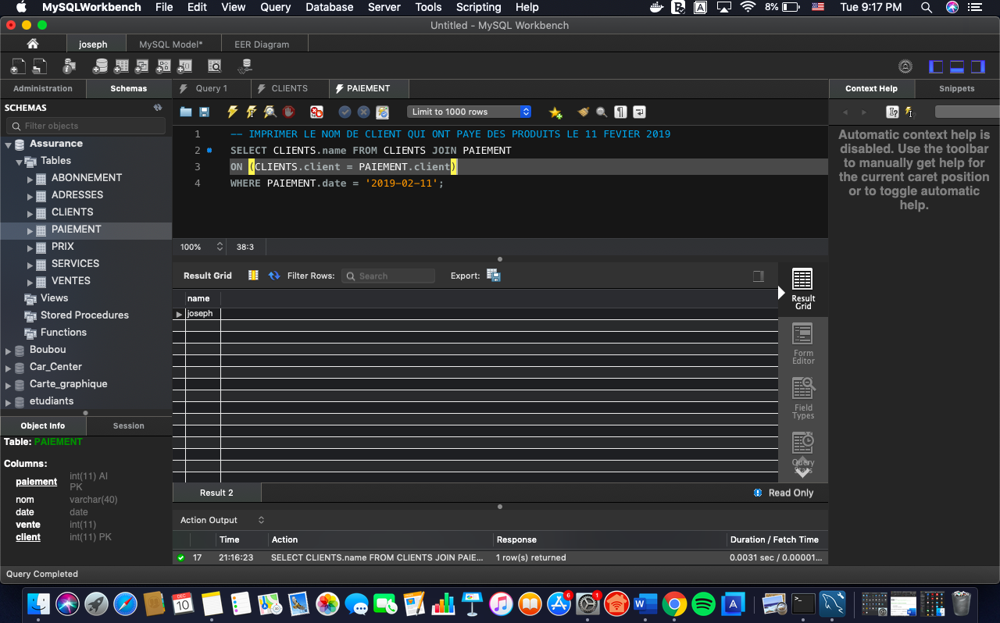
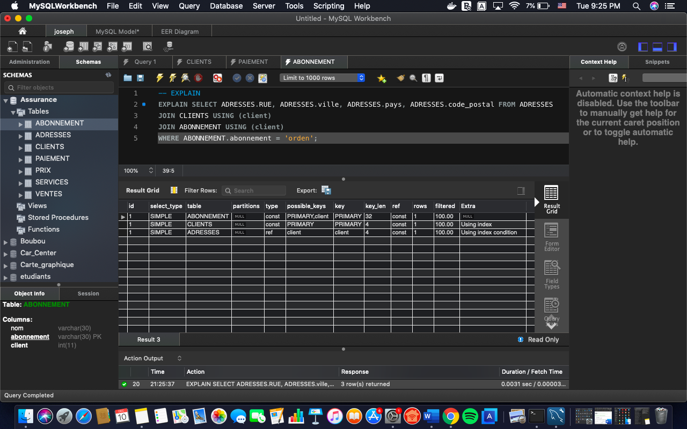

# Assurance


## Rapport
1- IMPRIMER LE NOMBRE TOTAL DE CLIENTS.




## REQUETES
:one: 
```sql
SELECT COUNT(client) FROM CLIENTS;
```

## Rapport 
2-  IMPRIMER LE NOM DE CLIENT QUI ONT PAYE DES PRODUITS LE 11 FEVIER 2019


## REQUESTES
:two:
```sql
SELECT CLIENTS.name FROM CLIENTS JOIN PAIEMENT
ON (CLIENTS.client = PAIEMENT.client)
WHERE PAIEMENT.date = '2019-02-11';
```

## Rapport
3 - IMPRIMER LA RUE , LA VILLE ,LE PAYS ET LE CODE_POSTALE DES CLIENTS QUI ONT DES ABONNEMENTS AVEC ORDEN


## REQUESTES
:three:
```sql
SELECT ADRESSES.RUE, ADRESSES.ville, ADRESSES.pays, ADRESSES.code_postal FROM ADRESSES
JOIN CLIENTS USING (client)
JOIN ABONNEMENT USING (client)
WHERE ABONNEMENT.abonnement = 'orden';
```
## EXPLAIN


