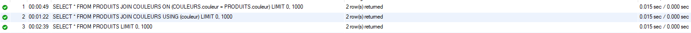
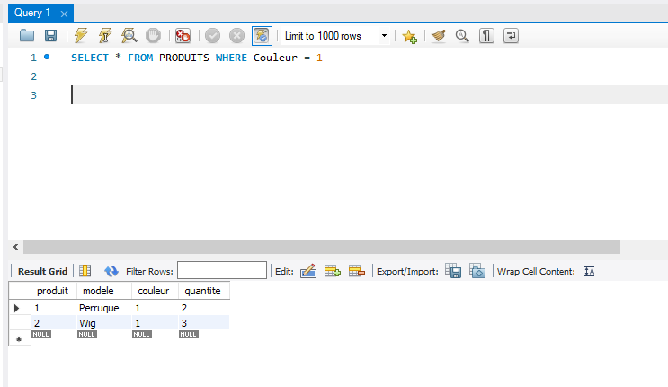

# :cyclone: Base des donnees

### :one: Reverse Engineering

### :two: Les Requêtes

:heavy_check_mark: Imprimer toutes les tables produits.

:heavy_check_mark: Imprimer toutes les tables clients.

:heavy_check_mark: imprimer toutes les tables payements.

:heavy_check_mark: Imprimer tout produit dont la couleur id = 1

### :three: Les Requêtes Sans Jointures

:white_check_mark: SELECT * FROM PRODUITS;

:white_check_mark: SELECT * FROM CLIENTS;

:white_check_mark: SELECT * FROM PAYEMENTS;

:white_check_mark: SELECT * FROM PRODUITS WHERE Couleur = 1;

### :four: Les Requêtes Avec Jointures

:white_check_mark: SELECT * FROM PRODUITS JOIN COULEURS ON (COULEURS.couleur = PRODUITS.couleur);

:white_check_mark: SELECT * FROM PRODUITS JOIN COULEURS USING (couleur);

