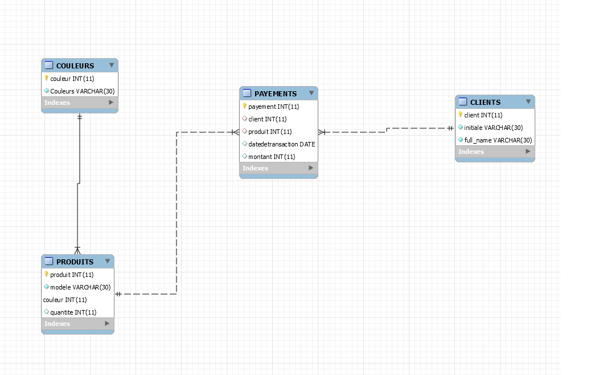

# :Base des donnees

### :one: Reverse Engineering

### :two: Les requettes

### :three: Les requettes sans Jointures

SELECT * FROM PRODUITS
SELECT * FROM CLIENTS
SELECT * FROM PAYEMENTS

### :four: Les requettes avec Jointures

SELECT * FROM PRODUITS JOIN COULEURS ON (COULEURS.couleur = PRODUITS.couleur)

SELECT * FROM PRODUITS JOIN COULEURS USING (couleur)

