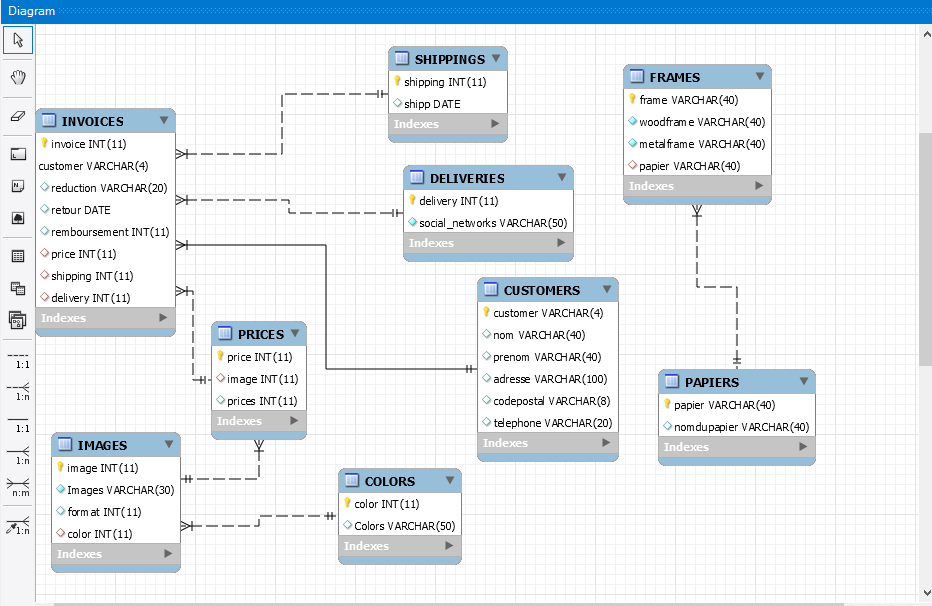

## WIDESIGN (MODELE )




:one:-Imprimer le nombre total des clients 

```sql
SELECT count(customer) FROM CUSTOMERS;
```

:two:- Imprimer le nom et le numero de telephone des clients ainsi que les dates ils ont retournés leur produit 

```sql
SELECT CUSTOMERS.nom, CUSTOMERS.telephone, INVOICES.retour
FROM CUSTOMERS
JOIN INVOICES 
ON (CUSTOMERS.customer = INVOICES.customer);
```


:three:-Imprimer le nom et le codepostal des clients qui ont eu des reductions 

```sql
SELECT CUSTOMERS.nom, CUSTOMERS.codepostal, INVOICES.reduction
FROM CUSTOMERS
JOIN INVOICES 
ON (CUSTOMERS.customer = INVOICES.customer);
```
